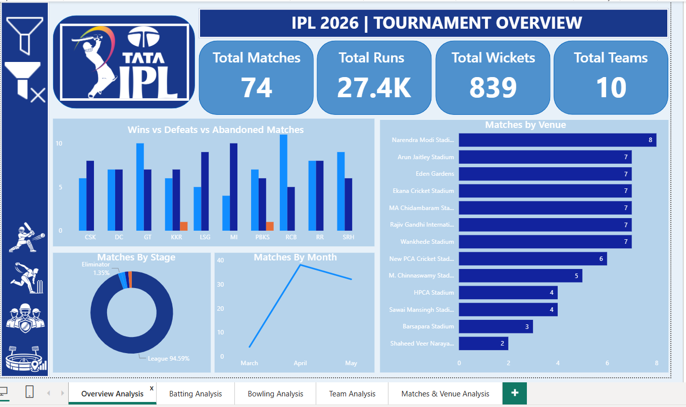
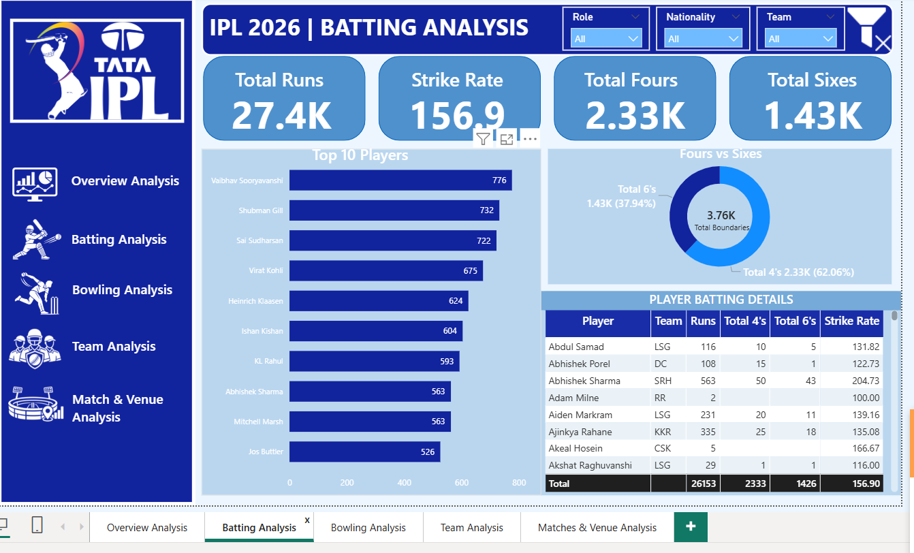
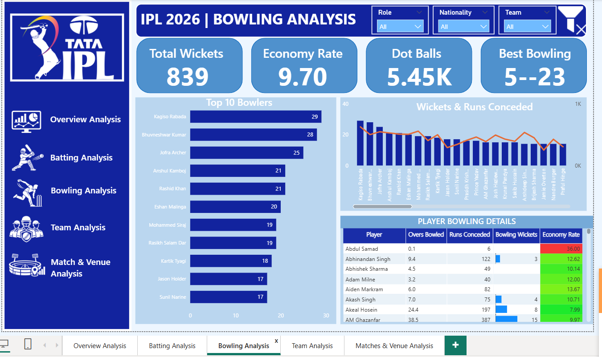
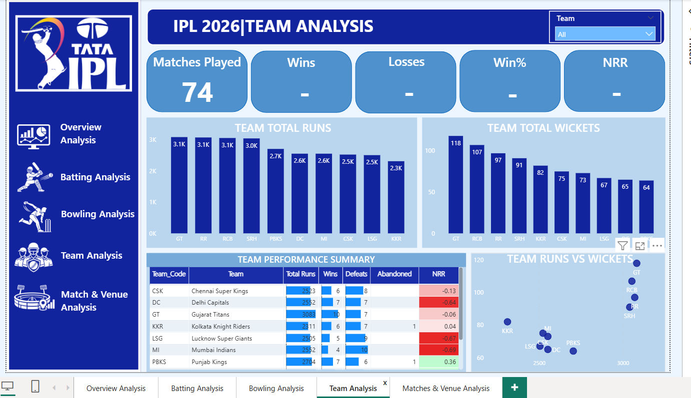
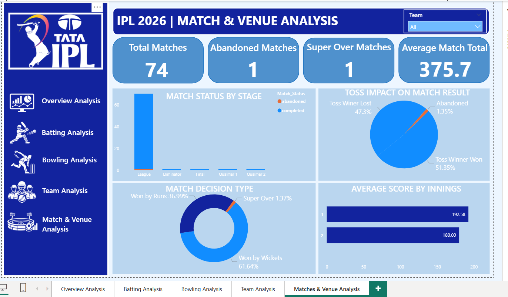

# 🏏 IPL 2026 Cricket Analytics — MySQL & Power BI

An end-to-end IPL 2026 analytics project built using **MySQL and Power BI** to analyze match, ball-by-ball, player, team, and venue data.

The project covers data cleaning, standardization, validation, data modeling, DAX-based KPI development, and interactive dashboard design.

---

## 🔗 Live Dashboard

[View Interactive Power BI Dashboard](https://app.powerbi.com/view?r=eyJrIjoiMzI4ZGFjZmYtNWQzZC00ZWVmLWFmOTgtNTliZjQ1OWE4N2IxIiwidCI6IjZiMTYyNTQ0LTc4NDUtNGJkMC05NzNkLTJjOGQ0OGJlZDg0MyJ9&pageName=e1f0af8f331480310d07
)

## 📌 Project Overview

This project analyzes IPL 2026 data to understand:

- Overall tournament performance
- Batting performance and top run scorers
- Bowling performance and wicket takers
- Team performance and Net Run Rate
- Match outcomes and decision types
- Venue-level scoring patterns
- Abandoned and Super Over matches

The final solution consists of a **five-page interactive Power BI dashboard**.

---

## 🛠️ Tools & Technologies

- **MySQL** — Data storage, cleaning, transformation and validation
- **SQL** — Data preparation and analysis
- **Power BI** — Dashboard development and visualization
- **Power Query** — Data transformation
- **DAX** — Measures and cricket-specific KPIs
- **Git & GitHub** — Version control and project documentation

---

## 📂 Data

The project uses multiple IPL datasets covering:

- Match information
- Ball-by-ball deliveries
- Player squads
- Venues

The data was loaded into MySQL and prepared before being connected to Power BI.

---

## 🔄 Data Preparation & Cleaning

The raw data required several preparation steps before analysis.

### Data Cleaning

- Converted string dates into proper date values
- Converted score and numeric fields into appropriate data types
- Standardized team names
- Standardized player names for reliable matching
- Standardized venue names using mapping tables
- Handled blank and missing values
- Validated match and delivery coverage

### Data Validation

Validated:

- Match count and match IDs
- Delivery coverage across matches
- Team mappings
- Venue mappings
- Player mappings
- Match-level and delivery-level data consistency

A data-quality issue was identified where some delivery-level totals did not exactly match match-level scorecard totals. Instead of overwriting one source with another, match-level data was retained for match reporting while delivery-level data was used for detailed player and ball-level analysis.

---

## 🧩 Data Model

The Power BI model uses a structured analytical design with role-based team dimensions.

### Main analytical tables

- `matches`
- `deliveries`
- `squads`
- `venues`
- `dim_team`
- `Date_Table`

### Role-playing team dimensions

Separate team dimensions were used for different team roles, including:

- Team 1
- Team 2
- Batting Team
- Bowling Team
- Toss Winner

This allows the same team dimension structure to be used across different analytical contexts.

---

## 📊 Key DAX & Analytics

The dashboard includes cricket-specific calculations such as:

### Batting

- Total Team Runs
- Batting Runs
- Strike Rate
- Fours
- Sixes
- Top Run Scorers

### Bowling

- Wickets
- Legal Balls
- Economy Rate
- Dot Balls
- Runs Conceded
- Overs Bowled
- Best Bowling

### Team Performance

- Matches Played
- Wins
- Losses
- Win %
- Team Runs
- Team Wickets
- Net Run Rate (NRR)

### Match Analysis

- Match Status
- Match Decision Type
- Abandoned Matches
- Super Over Matches
- Average Match Total
- Average Score by Innings

Advanced DAX functions such as `TREATAS` and `USERELATIONSHIP` were used where standard filter propagation was not sufficient for the required analytical context.

---

# 📈 Power BI Dashboard

## 1. Overview

Provides a high-level view of the tournament with:

- Total Matches
- Total Team Runs
- Total Wickets
- Total Teams
- Team Performance
- Matches by Venue
- Matches by Stage
- Monthly Match Trends



---

## 2. Batting Analysis

Analyzes player batting performance using:

- Total Team Runs
- Strike Rate
- Fours
- Sixes
- Top 10 Players
- Boundary Distribution
- Player-level batting details



---

## 3. Bowling Analysis

Provides detailed bowling performance analysis:

- Total Wickets
- Economy Rate
- Dot Balls
- Best Bowling
- Top 10 Wicket Takers
- Economy Rate by Bowler
- Wickets vs Runs Conceded
- Bowling Details



---

## 4. Team Analysis

Provides team-level performance analysis:

- Matches Played
- Wins
- Losses
- Win %
- Net Run Rate
- Team Total Runs
- Team Total Wickets
- Team Performance Summary



---

## 5. Match & Venue Analysis

Analyzes match outcomes and venue performance:

- Total Matches
- Abandoned Matches
- Super Over Matches
- Average Match Total
- Match Status by Stage
- Average Score by Innings
- Match Decision Type
- Toss Impact on Match Result



---

## 🔍 Key Analytical Highlights

- Built a five-page interactive Power BI dashboard for IPL 2026.
- Combined match-level and ball-by-ball data for different analytical requirements.
- Standardized inconsistent player, team, and venue names.
- Developed cricket-specific DAX measures for batting, bowling, team performance and NRR.
- Used role-playing team dimensions to support different team contexts.
- Identified and documented inconsistencies between match-level and delivery-level score data.
- Included interactive team, role and nationality filters across analytical pages.

---

## 📁 Project Structure

```text
IPL-2026-Cricket-Analytics/
│
│
├── sql/
│   ├── tables.sql
│
├── IPL_DASHBOARD.pbix
│
├── images/
│   ├── Overview_dashboard.png
│   ├── Batting_Analysis_dashboard.png
│   ├── Bowling_Analysis_dashboard.png
│   ├── Team_Analysis_dashboard.png
│   └── Matches&Venue_Analysis_dashboard.png
│
└── README.md
